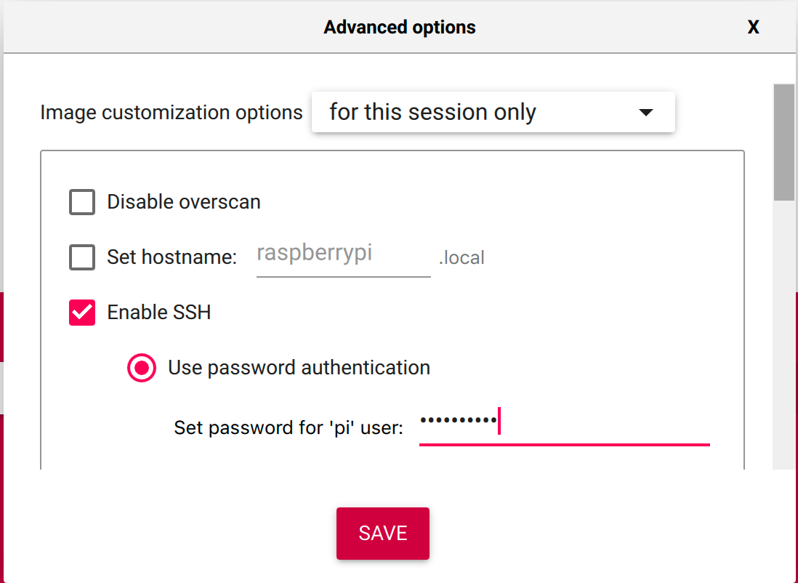
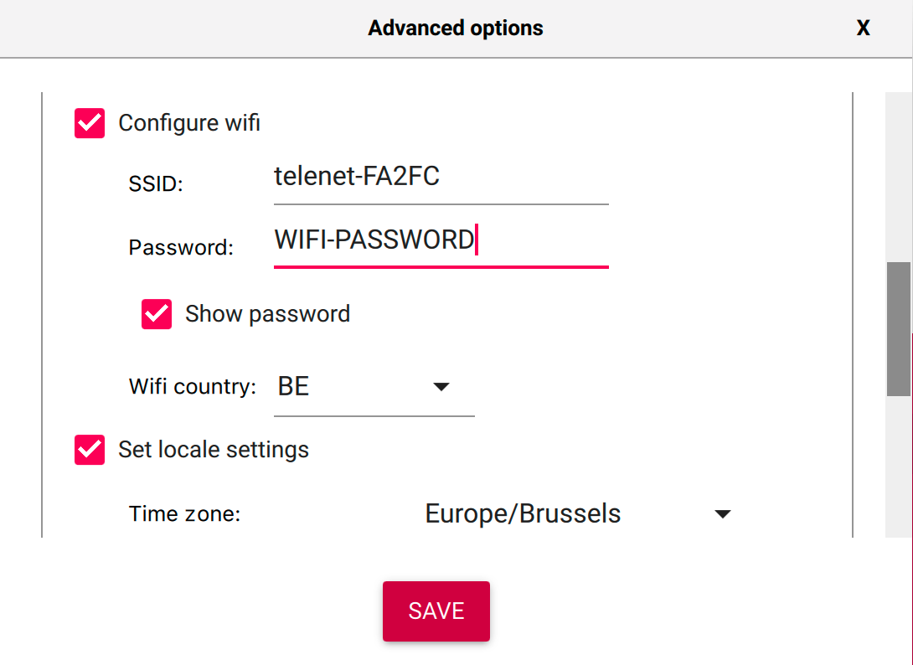
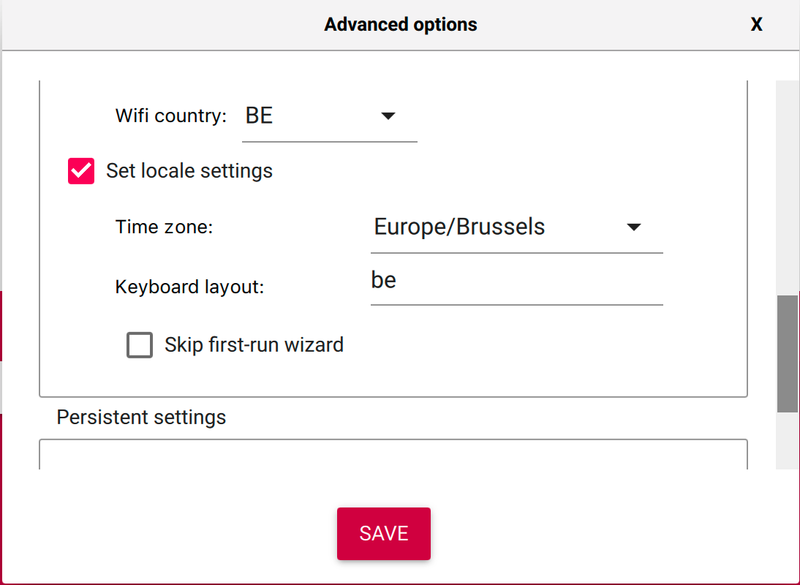

# Raspberry Pi Ansible scripts

A few ansible scripts to configure a new Raspberry Pi.

## Prerequisites

1. Download the [Raspberry Pi Imager tool](https://www.raspberrypi.org/software/). 
   Make sure you have version 1.6 (or newer).
2. Insert a (new) SD card into your computer (8GB works, but better 16GB or more).
3. In the Imager tool select **"Raspberry Pi OS (32-bit)"**. This is a "minimal" desktop version, and we will 
   install all extra tools needed with one of the provided scripts in this repository later.

   

4. While on the main screen of the Imager tool, use the hidden extra menu with "CTRL+SHIFT+X" for extra settings
   (for more info see ["Raspberry Pi Imager update to v1.6"](https://www.raspberrypi.org/blog/raspberry-pi-imager-update-to-v1-6/)).
   * Enable SSH and set a password for the "pi" user (pick one which is more secure that the one in the screenshot)

   
   
   * If you want to use Wifi instead of wired network connection, provide the SSID and Password

   
   
   * Set the locale settings to fit your region, language and keyboard layout

   

5. Hit the "Choose Storage" button to select your SD card.

6. Hit the "Write" button to start writing the OS and settings to the SD card.

7. When the writing is finished, you can insert the SD card into your Raspberry Pi.

## Use Ansible to install additional tools

There are two possible approaches to use Ansible to install extra tools.

### Run the Ansible scripts on another PC 

1. Clone this project to your PC:

```
$ git clone https://github.com/FDelporte/RaspberryPiAnsible.git
$ cd RaspberryPiAnsible
```

2. Create the inventory file `hosts` for which the ansible scripts will run, the IP address (`ansible_host`) and
   password (two times as `ansible_ssh_pass` and `ansible_sudo_pass`) needs to be the one of your Raspberry Pi:

```
all:
  vars:
    ansible_user: pi
  hosts: 
    my_raspberry_pi:
      ansible_host: 10.0.110.100
      ansible_ssh_pass: "raspberry"
      ansible_sudo_pass: "raspberry"
      ansible_ssh_common_args: '-o StrictHostKeyChecking=no'
```

3. You can now execute one of the ansible scripts with the following command:

```
ansible-playbook -i hosts <playbook-file>.yml
```
   
### Run the Ansible scripts on the Raspberry Pi itself

1. Open a terminal and run the following commands to install the Ansible tool:

```
$ sudo apt update
$ sudo apt install -y ansible sshpass
```

2. Now clone this project:

```
$ git clone https://github.com/FDelporte/RaspberryPiAnsible.git
$ cd RaspberryPiAnsible
```

3. Create the inventory file `hosts` for which the ansible scripts will run:

```
localhost
```

4. You can now execute one of the ansible scripts with the following command:

```
ansible-playbook -c local -i hosts <playbook-file>.yml
```

## Ansible scripts in this project

This project provides multiple scripts, depending on the work you want to do. Run one or more
of these scripts.

* all_for_java.yml
   * Full OS upgrade
   * Installs packages: wget, vim, git, build-essential
   * For Java development: Maven, Java OpenJDK 11, JavaFX 17, Maven
   * IDE: Visual Studio Code
* auto_login.yml
   * Changes raspi-config settings to automatically login at startup (no user/password screen)
* clone_pi4J_examples.yml
   * Clone the Pi4J V2 example projects to the directory /home/pi/pi4j/
   
## Testing the kiosk mode

When you started with a server-edition (without Desktop) and used the "javafx-kiosk.yml" Ansible script,
you are ready to run a JavaFX application in kiosk mode. The Raspberry Pi is started with a black screen and the cursor
but you won't be able to do much...

To try out a JavaFX application, connect via SSH and run the following commands to 

1. Download the sources to your Raspberry Pi
2. Move to the downloaded directory
3. Build the project
4. Move to the target > distribution directory
5. Run the application with the provided run-script

```
 cd /home/pi/pi4j/pi4j-example-javafx
 mvn package
 cd target/distribution
 sudo ./run.sh
```

Remark: if you run these commands from an SSH terminal, you may need to replace the last command with the 
following one to tell your system where the application must be displayed:

```
DISPLAY=:0 sudo ./run.sh
```
