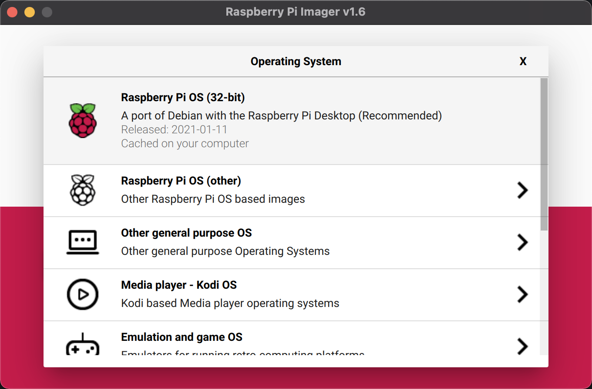

# Raspberry Pi Ansible scripts

A few ansible scripts to configure a new Raspberry Pi.

## Prerequisites

1. Prepare an SD card with the [Raspberry Pi Imager tool](https://www.raspberrypi.org/software/) 
   and select **"Raspberry Pi OS (32-bit)"**. This is a "minimal" desktop version, and we will 
   install all extra tools needed with one of the provided scripts in this repository.
   * When you want to create a **"kiosk mode" JavaFX application** which only shows the JavaFX application, 
    and no other desktop please select **"Raspberry Pi OS (32-bit)" > "Raspberry Pi OS Lite (32-bit)"**.



2. Optional: before inserting the SD-Card, add an empty file `ssh` to the root of the boot partition on the SD-Card, so that SSH is already enabled.

3. When the SD card is ready, put it in your Raspberry Pi, power it up and follow the on-screen 
   step-by-step to select your language, configure Wifi, install updates, etc.

4. In the terminal, run `sudo raspi-config`, go to `Interface Options`, and enable SSH, if you didn't already add the `ssh` file to the boot partition


## Use Ansible to install additional tools

There are two possible approaches to use Ansible to install extra tools.

### Run the Ansible scripts on another PC 

1. Clone this project to your PC:

```
$ git clone https://github.com/FDelporte/RaspberryPiAnsible.git
$ cd RaspberryPiAnsible
```

4. Create the inventory file `hosts` for which the ansible scripts will run:

```
all:
  vars:
    ansible_user: pi
  hosts: 
    crowpi:
      ansible_host: 10.0.110.100
```

4. You can now execute one of the ansible scripts with the following command:
```
ansible-playbook -i hosts <playbook-file>.yml
```
   
### Run the Ansible scripts on the Raspberry Pi itself

1. Open a terminal and run the following commands to install the Ansible tool:

```
$ sudo apt update
$ sudo apt install -y ansible sshpass
```

2. Now clone this project:
```
$ git clone https://github.com/FDelporte/RaspberryPiAnsible.git
$ cd RaspberryPiAnsible
```

3. Create the inventory file `hosts` for which the ansible scripts will run:

```
localhost
```

4. You can now execute one of the ansible scripts with the following command:
```
ansible-playbook -c local -i hosts <playbook-file>.yml
```

## Run the ansible scripts

This project provides multiple scripts, depending on the work you want to do. Run one or more
of these scripts.

| Script            | Java      | JavaFX    | Maven     | VSC       | Extra                 |
| :---              | :---:     | :---:     | :---:     | :---:     | :---                  |
| javafx.yml        | Yes       | Yes       | Yes       | Yes       |                       |
| javafx-kiosk.yml  | Yes       | Yes       | Yes       | -         | X11 for kiosk mode    |
